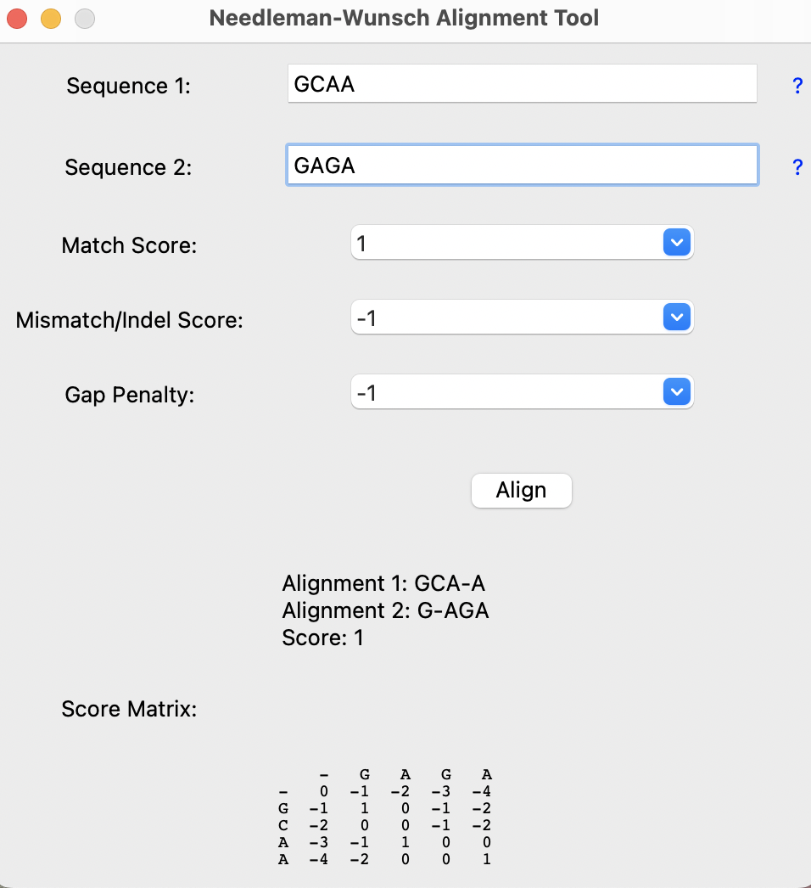

# Needleman-Wunsch Alignment Tool

Needleman-Wunsch Alignment Tool is a program used to align nucleotide sequences. This program uses the Needleman-Wunsch algorithm which is a dynamic programming algorithm 
that compares two sequences and compares them to find an optimal alignment. The user can enter two DNA sequences and select the match score, mismatch/indel score, and
the gap penalty. After clicking align, they will see the optimal alignment, score, and thed score matrix used to find the optimal alignment and score. 

### How to run
Type the following command into the terminal:
```
python algorithm_gui.py
```

### Example output
Using the following values as the input:
```
Sequence 1: GCAA
Sequence 2: GAGA
Match score: 1
Mistmatch/Indel score: -1
Gap penalty: -1
```
The following is the result:


